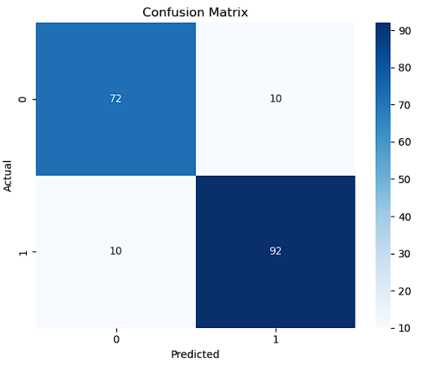
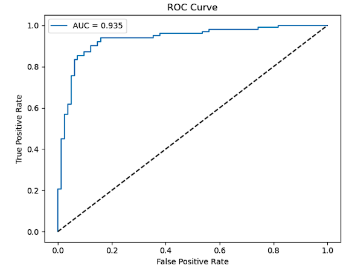
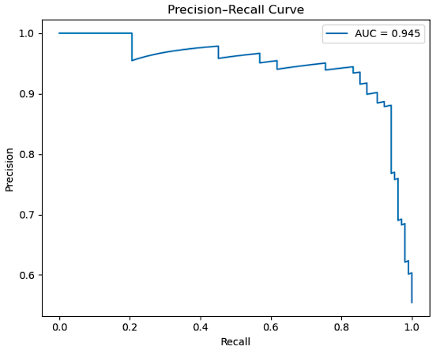
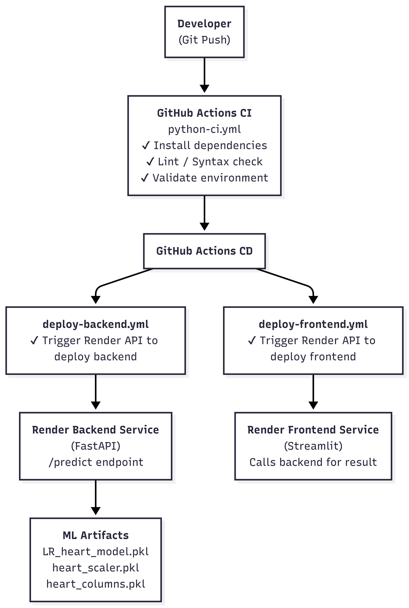

# ❤️ Heart Disease Prediction – End-to-End ML Application


An **end-to-end Machine Learning classification system** to predict **heart disease risk**, covering the complete lifecycle from **EDA → model development → deployment → CI/CD automation.**

---

## 🚀 Live Application
- **Frontend (Streamlit UI):** https://heart-frontend-wjty.onrender.com

- **Backend API (FastAPI):**  https://heart-api-wb2j.onrender.com 

Note: Render free-tier services may take a few seconds to wake up.

---

## 📌 Project Overview

This project demonstrates how a **real-world ML problem** can be taken from raw data to a **production-ready system.**

### Key Highlights:
- Complete Exploratory Data Analysis (EDA)
- Feature engineering and preprocessing
- Multiple ML model training and evaluation
- Model diagnostics for interpretability
- Backend & frontend integration
- Cloud deployment with CI/CD pipelines

---

## 🧠 Machine Learning Pipeline

### 🔹 Problem Type
- Binary Classification

### 🔹 Target Variable
- `HeartDisease` 
   - 0 → No Heart Disease
   - 1 → Heart Disease

### 🔹 Final Feature Set
- Age 
- RestingBP
- Cholesterol
- FastingBS
- MaxHR 
- Oldpeak
- HeartDisease
- Sex_M
- ChestPainType_ATA
- ChestPainType_NAP
- ChestPainType_TA
- RestingECG_Normal
- RestingECG_ST
- ExerciseAngina_Y
- ST_Slope_Flat
- ST_Slope_Up
- AgeGroup_Middle-aged
- AgeGroup_Senior

---

## 📊 Exploratory Data Analysis (EDA)

### Performed comprehensive EDA using:
- Histograms
- Count plots
- Box plots
- Violin plots
- Correlation heatmap

### Key Insights
- Age and MaxHR follow reasonable distributions
- Cholesterol and RestingBP contained invalid zero values
- Several features show strong correlation with heart disease

---

## 🧹 Data Cleaning

- Identified and fixed logical data errors
   - Cholesterol = 0 → invalid
   - RestingBP = 0 → invalid

- Applied appropriate data corrections before modeling

---

## ⚙️ Data Preprocessing & Feature Engineering
- Created Age Groups (Young / Middle-aged / Senior)
- One-hot encoding for categorical features
- Feature scaling using StandardScaler
- Ensured column consistency for inference

---

## 🤖 Model Training & Evaluation

### Models Trained
- **Logistic Regression** (final)
- KNN
- Naive Bayes
- Decision Tree
- SVM (RBF Kernel)
- Random Forest Classifier
- Gradient Boosting Classifier
- XGB Classifier

### Evaluation Metrics
- Accuracy
- Precision
- Recall
- F1 Score
- ROC-AUC

### Final Model Selection
- **Logistic Regression** chosen based on:
   - Strong performance
   - Balanced precision & recall
   - High interpretability (important for healthcare)

---

## 📊 Model Diagnostics

### 🔹 Confusion Matrix


### 🔹 ROC Curve


### 🔹 Precision–Recall Curve
 

### 🔹 Classification Report


### Key Observations
- Low false-negative rate (critical for medical use cases)
- Strong class separation (ROC-AUC ≈ 0.93)
- Balanced performance across both classes

---

## 💾 Model Persistence

Saved artifacts for production inference:
- Trained Logistic Regression model
- Feature scaler
- Final feature list

Ensures **consistent preprocessing during deployment.**

---

## 🧩 Backend – FastAPI

### API Endpoints

***POST /predict*** 

Input (JSON):

{
  "Age": 45,
  "Sex": "Male",
  "ChestPainType": "ATA",
  "RestingBP": 120,
  "Cholesterol": 230,
  "FastingBS": 0,
  "RestingingECG": "Normal",
  "MaxHR": 150,
  "ExerciseAngina": "No",
  "Oldpeak": 1.2,
  "ST_Slope": "Flat"
}


Output:

{
  "prediction": 1,
  "probability": 0.87
}

### Backend Stack
- FastAPI
- Pydantic
- Uvicorn
- Scikit-learn
- Joblib

---

## 🎨 Frontend – Streamlit

### Features
- User-friendly input interface
- Real-time predictions
- Risk interpretation (High / Low)
- Backend timeout handling for Render cold starts

---

## ☁️ Deployment (Render)

- Backend and frontend deployed as separate services
- Environment-based backend URL configuration
- Fully cloud-hosted and publicly accessible

---

## 🔁 CI/CD Pipeline (GitHub Actions)

### Continuous Integration (CI)
- Dependency installation
- Import and syntax validation
- Environment consistency checks

### Continuous Deployment (CD)
- Separate workflows for:
   - Backend deployment
   - Frontend deployment
- Triggered automatically on GitHub push
- Uses Render API tokens securely 

### CI/CD Architecture 



---

## 🧰 Tech Stack

- **Language:** Python
- **ML:** Pandas, NumPy, Scikit-learn, XGBoost
- **Backend:** FastAPI, Uvicorn
- **Frontend:** Streamlit
- **DevOps:** GitHub Actions, Render
- **Version Control:** Git, GitHub

---

## 🏁 How to Run Locally

### Backend

```bash
cd backend
pip install -r requirements.txt
uvicorn heart_api:app --reload
```

### Frontend

```bash
cd frontend
pip install -r requirements_frontend.txt
streamlit run streamlit_app.py 
``` 

---

## 📈 Future Enhancements

- SHAP-based model explainability
- Dockerization
- Model monitoring & drift detection
- Authentication and rate limiting
- Automated retraining pipelines

---

## 🎯 Resume-Ready Highlights

- Built a **full end-to-end heart disease prediction system**
- Performed **complete EDA and feature engineering**
- Trained and evaluated multiple classification models
- Designed **FastAPI backend** for real-time inference
- Developed **Streamlit frontend** for user interaction
- Implemented **CI/CD pipelines using GitHub Actions**
- Deployed scalable services on **Render**

---

## 👤 Author

**Tanu Dewangan**  
Machine Learning | Data Science | End-to-End ML Systems

🔗 GitHub: https://github.com/TanuDewangan 

---